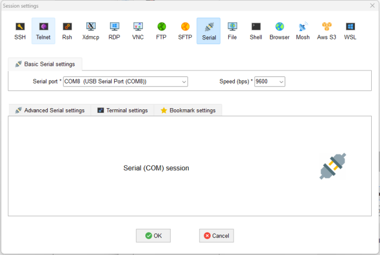

# NEXYS_A7 调试说明

本调试/展示功能仅适用于所给的 NEXYS A7 代码框架，如果同学们选择使用之前自己设计的CPU，可以参考
代码框架自行实现相关功能。

## 包装内容

打开板子的包装如下：

{.center}

包含开发板和一根数据线，开发板和数据线都请**妥善保管**，学期结束时我们会对其进行回收。

## 连接电脑并上板

配备的数据线既能提供电源传输，也能提供输出传输的功能，其一端为类似 micro usb 的插头，另一端为 USB type-A。将 USB type-A 连接电脑，将另一端连接板子上特定的接口，接口所在位置如下：

{.center}

连接后波动如下标注的按钮开启板子电源:

{.center}

随后将比特流传入开发板即可。

## 调试方法

NEXYS A7 提供了 USB-UART 的桥接，这使得我们可以直接通过烧写bitstream的数据线让开发板和电脑通信。为了使用串口看到每个周期数据的变化情况，大部分实验将使用单步调试的方式进行，为了使用串口进行单步调试，需要：（开关的编号为正对开发板从右到左为 0 到 15）

- 将 `SW[0]` 切换到高电平，开启单步调试模式。
- 将 `SW[8]` 切换到高电平，开启 UART 调试模式。

### Windows 11 的调试工具（推荐）

在 Windows 平台可以使用 MobaXterm 这个终端工具来接受串口信息，可以在其[官网](https://mobaxterm.mobatek.net/)免费下载。

为了用数据线将开发板连接到电脑，需要知道其端口号，连接开发板，查看设备管理器，在如下位置找可以发现对应的 USB Serial Port，记住其端口号（如下图为 COM8）。

{.center}

使用 MobaXterm 建立对应的 Session：

- 打开 MobaXterm，点击 Session。

    {.center}

- 在弹出的窗口中选择 "Serial"

    {.center}

- 在 Serial Port 选择开发板串口对应的端口编号，并将左侧的 Speed 设为 9600.

    {.center}

- 点击 OK，即可完成 Session 的创建。
- 后续需要使用串口调试时，直接打开 MobaXterm，在已经创建好的 Session 中选择前面创建的 Session 即可。

    {.center}

### Ubuntu 22.04 调试工具

首先需要安装串口通讯的工具，可以通过终端运行如下命令安装 `minicom` 串口通讯工具：

```bash
sudo apt-get update
sudo apt-get install minicom
```

再根据串口的设备号，使用以下命令可以查看所有可以使用的串口设备。

可以在连接板子前先查看一次，连接板子后再查看一次，看看多出来了哪个串口设备，就能推测其为板子对应的串口设备。
运行如下命令打开 minicom 的配置界面。

```bash
sudo minicom -s
```

按照如下步骤配置：

- 选择 "Serial Port Setup"，按下回车键。
- 随后会列出几个选项，选择对应选项前面的字母即可对其进行修改，修改完成后按下回车完成更改。
- 在 "Serial Device" 修改为板子对应的串口设备名称，如串口设备 ttyUSB1 则在 "Serial Device" 处修改为 /dev/ttyUSB1 ，有可能有多个新增设备，可以一个个试试找到正确的那个。
- 设置波特率，数据位，停止位等参数，实验表示，设置为如下参数即可。

    {.center}

- 按回车退出 Serial Port Setup 部分，随后选择 "Save setup as dfl"，按下回车，再选择 "Exit" 退出设置界面。
- 使用如下命令即可开始接收串口信息：

    ```bash
    sudo minicom
    ```

- 退出调试工具，则先按下 ctrl+A 松开后快速按下 X ，这一波关闭的操作需要熟悉一下，~~实在不行把 terminal 直接关了罢~~。完成配置并成功接收到串口数据后，后续调试则不需要重新配置。

## 串口单步调试的步骤

- 先将开发板连接到自己的电脑，并通电。
- 将开发板的 `SW[0]` 和 `SW[8]` 切换到高电平。
- 在 vivado 工程中生成比特流，并将比特流传入开发板，由于此时是单步调试模式，在不主动触发时钟时项目 不会主动运行。
- 打开对应系统上的接收串口信息的调试工具，使其能够接收串口信息。
- 按下按钮 BTNR，使得项目执行一周期的任务，BTNR 在开发板上的位置如下所示。

    {.center}

- 此时可以看到该单步调试后各个寄存器中的信息会在串口调试工具中显示出来。

    {.center}

- 此时观察串口输出的信息来判断上板后的现象是否符合预期即可。